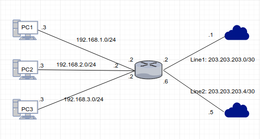
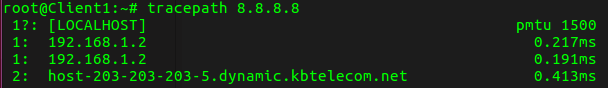
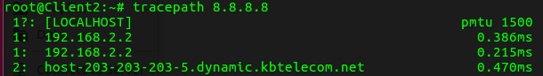
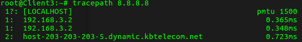
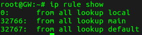
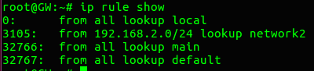
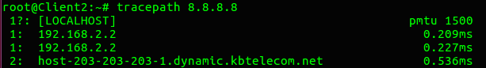
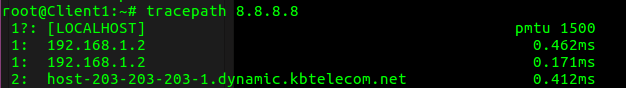
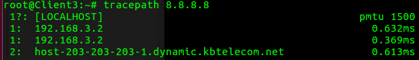

# Mô tả bài lab
  

Mạng nội bộ gồm 3 dải mạng là 192.168.1.0/24 (PC1), 192.168.2.0/24 (PC2) và 192.168.3.0/24 (PC3). Router có 2 đường kết nối đi ra Internet. Mặc định traffic của dải mạng 192.168.2.0/24 sẽ đi qua line 1 và mọi traffic của các dải mạng khác sẽ đi qua line 2. Vì lý do mạng chập chờn, tất cả các traffic sẽ được đẩy qua line 1 **thủ công**.  
Tạo 2 Router Internet1 và Internet2 để mô phỏng.  

# Cấu hình
**B1:** Bật IP forward trên các Router GW, Internet1 và Internet2 tạm thời
```
echo "1" > /proc/sys/net/ipv4/ip_forward
```
hoặc vĩnh viễn bằng cách uncomment dòng `net.ipv4.ip_forward=1` trong file `/etc/sysctl.conf`  

**B2:** NAT các IP trong mạng LAN
```
iptables -t nat -A POSTROUTING -o ens33 -j MASQUERADE
iptables -t nat -A POSTROUTING -o ens38 -j MASQUERADE
```

**B3:** Tạo default route cho các mạng LAN đi theo cổng ens38 (line 2) của Router GW
```
ip route add default via 203.203.203.5
```
Thử test đường ra Internet của 3 network  
  
  
  
Như có thể thấy cả 3 network đều chạy chạy line 2. Để dải mạng 192.168.2.0/24 chạy qua line 1, chúng ta phải sử dụng policy routing.  

**B4:** Tạo rule, routing table, route cho network 2  
Show các rule hiện có  
```
ip rule show
```
  
Mặc định sẽ có 3 rule, khi gói tin đến router, kernel sẽ tìm kiếm các rule có priority thấp nhất, nếu có bất kỳ rule nào khớp với gói tin thì kernel sẽ thực hiện hướng dẫn định tuyến trong rule đó.  
Vì vậy để các traffic của dải mạng 192.168.2.0/24 chạy qua line 1, chúng ta phải tạo 1 rule có priority thấp hơn priority 32766.  
Trước hết tạo routing table để rule tìm kiếm các thông tin định tuyến, mặc định thì cũng có 3 bảng routing là bảng local, main và default, các route khi khai báo mặc định sẽ được đưa vào bảng main. Các routing table được khai báo trong file `/etc/iproute2/rt_tables`. 
```
echo "100 network2" >> /etc/iproute2/rt_tables
```
Câu lệnh trên sẽ tạo 1 bảng có id là 100 và tên là **network2**. Tiếp theo add route mới vào bảng **network2**
```
ip route add default via 203.203.203.1 table network2
```
Kiểm tra lại thông tin định tuyến trong bảng network2
```
ip route show table network2
```
Sau khi route mới được thêm vào, ta add tiếp các rule để kernel tìm kiếm thông tin định tuyến
```
ip rule add from 192.168.2.0/24 table network2 priority 3105
```
Kiểm tra xem rule đã được add chưa
```
ip rule show
```
  
Như chúng ta thấy 1 rule mới đã được thêm vào với priority là 3105. Chúng ta thử kiểm tra xem network2 đã đi qua line 1 chưa.
  
Như vậy là các client của dải mạng 192.168.2.0/24 đã kết nối internet qua line 1, còn các network còn lại đi qua line 2.  

## Change traffic
Khi line 2 mạng chậm, đứt cáp, chúng ta muốn đẩy tất cả traffic qua line 1, ta chỉ cần sử dụng lệnh:
```
ip route replace default via 203.203.203.1
```
Câu lệnh này sẽ ghi đè default route trong bảng main đi qua line 2, khiến tất cả các traffic trong mạng sẽ đi qua line 1.  
  
  


## Note
Các câu lệnh add route và add rule trong bài viết đều sẽ mất khi reboot máy, để cấu hình được giữ lại kể cả khi reboot làm như sau:  
### Cách 1
Vào file `/etc/network/interfaces` và thêm các dòng sau
```
post-up ip route add default via 203.203.203.5
post-up ip route add default via 203.203.203.1 table network2
post-up ip rule add from 192.168.2.0/24 table network2 priority 3105
```

### Cách 2
Vào file `/etc/rc.local` và thêm dòng sau
```
/sbin/ip route add default via 203.203.203.5
/sbin/ip route add default via 203.203.203.1 table network2
/sbin/ip rule add from 192.168.2.0/24 table network2 priority 3105
```
