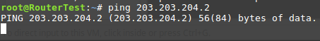

## Mô tả
1 Server gồm có 2 đường WAN, mỗi WAN có 1 default gateway. Nhưng theo mặc định thì chỉ được có 1 default route trong hệ thống (Ở đây VD Server dùng default route qua WAN1). Trường hợp này sẽ dẫn đến việc định tuyến không đồng bộ, Server có thể sẽ trả lời gói tin nhận được từ WAN2 qua WAN1 hoặc Server cũng có thể reject các gói dữ liệu.  
  

## Giải pháp
Có thể sử dụng policy routing để Server khi nhận được dữ liệu từ WAN nào thì sẽ trả lời gói tin qua WAN đó.  

## Cấu hình test 
Trên Linux Router đặt default route qua đường WAN1  
```
ip route add default via 203.203.203.3
```
Add route mạng 203.203.204.0/24 cho Router Test 
```
ip route add 203.203.204.0/24 via 203.203.206.3
```

## Test
Trên Router Test khi thử ping đến địa chỉ 203.203.204.2 (WAN2) của Linux Router sẽ không thành công.  
  
Mặc dù trên Linux Router vẫn nhận được được gói ICMP echo request
  
Nhưng vì bảng định tuyến của Linux Router không có route đến địa chỉ của Router Test nên nó sẽ bị loại bỏ chứ không gửi gói tin trả lời qua default route. Vì vậy phải cấu hình để những gói tin đi vào 1 WAN thì sẽ phải đi ra WAN đó. Trên Linux có thể sử dụng policy Routing để làm được điều này

## Policy Routing
Đầu tiên tạo 1 bảng định tuyến mới  
```
echo "100 test" > /etc/iproute2/rt_tables
```
Thêm default gateway cho WAN2
```
ip route add default via 203.203.204.3 table test
```
Sau đó tạo rule để những gói tin từ có source IP là WAN2 sẽ tìm kiếm thông tin định tuyến trong bảng **test**  
```
ip rule add from 203.203.204.2 table test
```
Tại sao lại lọc theo Source của WAN2??? Vì khi 1 gói tin đi đến WAN2 nó sẽ có địa chỉ Des là WAN2 và khi soạn gói tin trả lời, Router sẽ sử dụng địa chi WAN2 làm Source IP.  

## Test
Trên Router Test thử ping lại đến địa chỉ 203.203.204.2 (WAN2) của Linux Router.  
  
